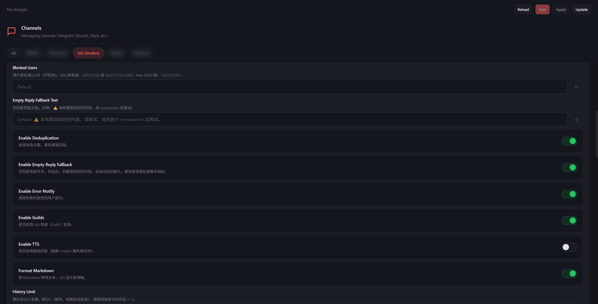

<p align="center">
  
</p>

<h1 align="center">OpenClaw QQ 插件（OneBot v11）</h1>

<p align="center">为 OpenClaw 提供可生产使用的 QQ 渠道接入：先快速跑通，再按需启用高级能力。</p>

<p align="center">
  [<a href="https://constansino.github.io/openclaw_qq/">在线文档</a>] [<a href="./docs/quickstart.md">3 分钟快速开始</a>] [<a href="./docs/config-reference.md">配置参考</a>] [<a href="https://github.com/constansino/openclaw_qq/blob/main/deploy/napcat/README.md">NapCat 部署</a>] [<a href="./docs/advanced.md">高级能力</a>]
</p>

<p align="center">
  <a href="https://github.com/constansino/openclaw_qq/blob/main/openclaw.plugin.json"></a>
  
  <a href="https://constansino.github.io/openclaw_qq/"></a>
</p>

> [!IMPORTANT]
> **官方交流论坛（唯一）：** https://aiya.de5.net/c/25-category/25  
> 问题反馈、配置经验、更新公告统一在论坛沉淀，便于检索和追踪。

## 最近更新（2026-03）

- 仓库文档现统一维护中文版本，仓库内英文 Markdown 已清理。
- 新增 OneBot HTTP 模式文档，支持通过 HTTP API + webhook 接入，说明见 `docs/http-transport.md`。
- QQ 私聊 session key 已回归官方命名风格：peer id 使用纯 QQ 号，不再写成 `qq:user:<id>`；旧本机会话会在启动时自动规范化。
- 新增 `keywordOnlyTrigger`：群聊可切换为“仅关键词触发”，忽略 @ / 回复触发，适合与其他机器人共用同一 QQ 账号。
- 新增 `showReplySessionSource`：回复前可标注来源会话，方便区分主会话与 `/临时` 会话。
- 自动重试 / Fast Fail / 并发合并 / 新消息打断 / 隐藏网关元数据等高级控制现已默认关闭，按需开启即可。
- WebUI 参数说明已补强；复杂配置说明统一下沉到 `docs/advanced.md` 与 `docs/config-reference.md`。

## 最近更新（2026-02）

- 修复 `channel restart` / `health-monitor` 重启循环，避免通道被误判退出后反复拉起。
- 增强 OneBot 连接状态判断：新增 `isConnected()` 防止同账号重复启动。
- 发送失败自动回队并触发重连，降低“日志显示已回复但 QQ 未落地”。
- 新增自动重试 + Fast Fail + Active Model Failover（接入 `openclaw.json` 的 `fallbacks`）。
- 新增并发防漏吞队列与同会话“新消息打断旧回复”。
- 新增 reply/forward 多层上下文解析与长回复自动合并转发。

## 这个项目的定位

很多 QQ 插件只做“基础渠道层”；`openclaw_qq` 的目标是：

- 默认配置可快速跑通。
- 面向生产群聊时，可逐步开启稳定性和风控能力。
- 把复杂能力做成“按需启用”，而不是强制每个人都用。

如果你只需要极简能力，请直接用最小配置；如果你需要高并发和低漏回，再启用高级选项。

## 功能总览

### 基础渠道能力

- [x] OneBot v11 WebSocket 接入（NapCat / Lagrange 等）
- [x] 私聊、群聊消息收发
- [x] QQ 频道（Guild）支持
- [x] @触发、关键词触发、白名单/黑名单控制

### 稳定性与容错

- [x] 连接自愈与指数退避重连
- [x] 发送失败回队
- [x] 模型自动重试（`maxRetries` / `retryDelayMs`）
- [x] Fast Fail 错误快速跳过（`fastFailErrors`）
- [x] Active Model Failover（主模型失败切备用）

### 上下文与交互增强

- [x] reply/forward 递归解析与分层上下文注入
- [x] 隐藏 QQ 网关元数据注入（`injectGatewayMeta`）
- [x] 可选回复来源会话标记（`showReplySessionSource`）
- [x] 同会话并发防漏吞队列（`queueDebounceMs`）
- [x] 新消息打断旧回复（`interruptOnNewMessage`）
- [x] 长回复自动合并转发（`forwardLongReplyThreshold`）

### 管理与安全

- [x] 管理员权限模型（`admins` / `adminOnlyChat`）
- [x] 自动通过好友申请/群邀请（可选）
- [x] 基础风控辅助（限速、URL 规避、空回复兜底）

## 当前进度（推荐阅读路径）

1. 已可稳定用于日常 QQ 机器人接入与群聊运营。
2. 文档已拆分为“快速开始 / 配置参考 / 高级能力”三级结构。
3. 正持续优化多账号、复杂上下文与运维可观测性。

建议按下面顺序阅读：

1. [3 分钟快速开始](./docs/quickstart.md)
2. [配置参考（分组版）](./docs/config-reference.md)
3. [高级能力与完整参数](./docs/advanced.md)
4. [NapCat 部署说明（GitHub）](https://github.com/constansino/openclaw_qq/blob/main/deploy/napcat/README.md)

## 3 分钟快速开始

### 1. 前置条件

- 已安装并运行 OpenClaw
- 已运行 OneBot v11 服务端（推荐 NapCat / Lagrange）
- OneBot 配置中 `message_post_format = array`

### 2. 安装

```bash
cd openclaw/extensions
git clone https://github.com/constansino/openclaw_qq.git qq
cd ../..
pnpm install && pnpm build
```

### 3. 优先使用 WebUI 配置（推荐）

在 OpenClaw WebUI 中直接配置 `channels.qq`，比手写 JSON 更直观，也更不容易出现格式错误。



建议先填以下核心项：

- `wsUrl`
- `accessToken`
- `requireMention`
- `admins`（可选）
- `allowedGroups`（可选）

### 4. 手动 JSON 配置（可选）

编辑 `~/.openclaw/openclaw.json`：

```json
{
  "channels": {
    "qq": {
      "wsUrl": "ws://127.0.0.1:3001",
      "accessToken": "your_token",
      "requireMention": true
    }
  },
  "plugins": {
    "entries": {
      "qq": { "enabled": true }
    }
  }
}
```

### 5. 启动与验证

```bash
openclaw gateway restart
```

验证：

- 私聊机器人可回复
- 群聊 @ 机器人可回复
- 日志无持续鉴权失败/重连风暴

## 文档

- 文档中心：`docs/index.md`
- 中文主文档：本 `README.md`

## 反馈与贡献

- 问题反馈 / 使用经验 / 需求建议：
  - https://aiya.de5.net/c/25-category/25
- 代码问题可直接提 GitHub Issue / PR。

## License

MIT
